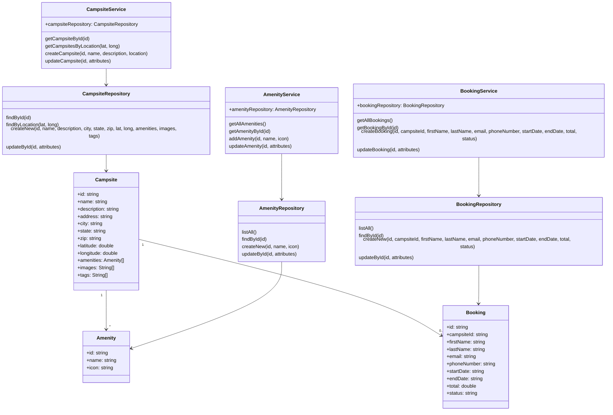

# it4045c-final-project

# Introduction

<b>Project:</b> RV Campground Booking App

<b>Goal:</b> Let users search availability, compare site options, and complete a booking with clear confirmation/cancellation.

## Storyboard (Screen Mockups)

1. <b>Home/Search</b>
- Destination/park input, dates (check-in/out), guests, rig length/type
- “Search availability”

2. <b>Results (Available Sites)</b>
- Cards: Site type (back-in/pull-through), max length, power (30A/50A), price/night, refund policy
- Sort (price, distance), filters (power, hookups, length)
- “Select” opens Site Details

3. <b>Site Details</b>
- Photos, amenities, map snippet
- Price breakdown (tax/fees), rules, cancellation window
- “Continue to booking”

4. <b>Booking / Guest & Rig</b>
- Contact info, rig details, special requests
- Policy acceptance checkbox

5. <b>Payment & Review</b>
- Summary, promo code, card entry
- "Pay & book"

6. <b>Confirmation</b>
- Booking ID, itinerary/ICS download, email receipt
- “Manage booking” (view, modify dates if allowed, cancel)

# Functional Requirements

## FR-1: Search & Availability

**As a user**  
I want to see only sites available for my dates and rig  
So that I can pick a bookable option that fits.

### Scenarios

- **Happy path – available sites returned**  
  *Given* check-in `2025-10-10`, check-out `2025-10-13`, rig length `30 ft`  
  *When* I search `"Gatlinburg, TN"`  
  *Then* I see only sites that permit ≥30 ft and are free for all 3 nights.  

- **Edge – no availability**  
  *Given* a holiday weekend  
  *When* I search with those dates  
  *Then* I see “No availability” plus suggestions: adjust dates, widen radius, clear filters.  

- **Validation – impossible date range**  
  *Given* check-out earlier than check-in  
  *When* I tap “Search”  
  *Then* the form blocks submission and highlights the date fields with “Check-out must be after check-in.”  

- **Constraint – rig too long**  
  *Given* rig length `45 ft`  
  *When* I search a park whose max length is `35 ft`  
  *Then* I see zero results for that park and a banner explaining the length constraint.  

---

## FR-2: Site Selection & Price Breakdown

**As a user**  
I want clear pricing before I commit  
So that I can compare sites confidently.

### Scenarios

- **Happy path – price calc**  
  *Given* a site at `$48/night` for 3 nights, taxes `10%`, service fee `$6`  
  *When* I open Site Details  
  *Then* I see subtotal `$144`, tax `$14.40`, service fee `$6`, total `$164.40`.  

- **Promo code – valid**  
  *Given* promo `FALL10` = 10% off subtotal  
  *When* I apply it  
  *Then* the subtotal reduces by `$14.40` and the new total is reflected before payment.  

- **Promo code – invalid/expired**  
  *Given* promo `SUMMER25` is expired  
  *When* I apply it  
  *Then* I see “Code expired or invalid” and totals remain unchanged.  

- **Policy visibility**  
  *Given* a site with a 72-hour free-cancel window  
  *When* I view price details  
  *Then* the cancellation window and penalties are visible before “Continue to booking.”  

---

## FR-3: Booking, Payment & Confirmation

**As a user**  
I want to enter guest/rig info, pay, and receive confirmation  
So that I can secure my stay.

### Scenarios

- **Happy path – successful booking**  
  *Given* valid contact info and card details  
  *When* I submit payment  
  *Then* I receive an on-screen confirmation with a Booking ID and an email receipt; the site becomes unavailable for those dates.  

- **Validation – required fields**  
  *Given* missing phone number  
  *When* I press “Pay & book”  
  *Then* the form blocks submission, focuses the missing field, and shows “Phone number is required.”  

- **Payment failure – card declined**  
  *Given* the gateway responds “Do not honor”  
  *When* I submit  
  *Then* I see an inline error with “Try another card,” and nothing is reserved.  

- **Idempotency – double click**  
  *Given* I double-click “Pay & book”  
  *When* the first charge succeeds  
  *Then* no duplicate booking or charge occurs; the UI shows a single confirmation.  

---

## FR-4: Manage Booking (View/Cancel/Modify*)

**As a user**  
I want to view and cancel my booking (and modify dates if allowed)  
So that I can manage plans without calling.  

\*Modify dates is optional if out of MVP; keep cancel/view in MVP.  

### Scenarios

- **View booking**  
  *Given* a valid Booking ID and email  
  *When* I open “Manage booking” and authenticate (email code)  
  *Then* I see dates, site, guests, price paid, and cancellation policy.  

- **Cancel within free window**  
  *Given* the policy allows free cancellation ≥72 hours before check-in  
  *When* I cancel 5 days before  
  *Then* I see “Full refund” and receive an email cancel receipt; inventory returns to available.  

- **Cancel after window (penalty)**  
  *Given* it’s 24 hours before check-in and policy charges first night  
  *When* I cancel  
  *Then* I see a refund of total minus one night; the exact refund is displayed before I confirm.  

- **Modify dates (if enabled)**  
  *Given* I request moving check-in by 1 day  
  *When* new dates are available  
  *Then* I see updated pricing (delta only if policy supports) and confirm to re-book; if unavailable, I see alternatives.  

---

## Notes

- **Out of scope (for now):** trip routing, packing lists, offline checklists.  
- **Unit test seeds:** Use the Given/When/Then above to drive tests for date validation, inventory hold, pricing math, refund rules, idempotent payment, and policy display.  
- **MVP tech:** Client-side forms + mocked API (JSON). Real payments later (Stripe).  
- **Accessibility:** Keyboard-navigable date picker, form errors announced to screen readers.

# Class Diagram 



# JSON Schemas

## Campsite

```json
{
  "id": "http://json-schema.org/geo",
  "$schema": "http://json-schema.org/draft-06/schema#",
  "title": "Campsite",
  "description": "Campsite object schema",
  "type": "object",
  "properties": {
    "id": {
        "type": "string"
    },
    "name": {
        "type": "string"
    },
    "description": {
        "type": "string"
    },
    "address": {
        "type": "string"
    },
    "city": {
        "type": "string"
    },
    "state": {
        "type": "string"
    },
    "zip": {
        "type": "string"
    },
    "latitude": {
        "type": "number"
    },
    "longitude": {
        "type": "number"
    },
    "amenities": {
        "type": "array"
    },
    "images": {
        "type": "array"
    },
    "tags": {
        "type": "array"
    },
    "price_per_day": {
        "type": "number"
    },
    "service_fee": {
        "type": "number"
    }
  },
  "required": [
    "id",
    "name",
    "address",
    "city",
    "state",
    "zip"
  ]
}
```

## Booking

```json
{
  "title": "Booking",
  "description": "Booking object schema",
  "type": "object",
  "properties": {
    "id": {
        "type": "string"
    },
    "campsite_id": {
        "type": "string"
    },
    "first_name": {
        "type": "string"
    },
    "last_name": {
        "type": "string"
    },
    "email": {
        "type": "string"
    },
    "phone_number": {
        "type": "string"
    },
    "start_date": {
        "type": "string"
    },
    "end_date": {
        "type": "string"
    },
    "total": {
        "type": "number"
    },
    "status": {
        "type": "string"
    }
  },
  "required": [
    "id",
    "campsite_id",
    "first_name",
    "last_name",
    "email",
    "start_date",
    "end_date",
    "total",
    "status"
  ]
}
```

# Scrum Roles

<table>
  <tr>
    <th>Scrum Role</th>
    <th>Team Member</th>
  </tr>
  <tr>
    <td>Scrum Master</td>
    <td>Jay Kroger</td>
  </tr>
  <tr>
    <td>Product Owner</td>
    <td>Brian Faught</td>
  </tr>
  <tr>
    <td>Developer</td>
    <td>Raymond Ha</td>
  </tr>
  <tr>
    <td>Developer</td>
    <td>Azzan Khan</td>
  </tr>
  <tr>
    <td>Developer</td>
    <td>Briar Elliot</td>
  </tr>
</table>

# GitHub Project
<a href="https://github.com/jkroger2/it4045c-final-project">Final Project Repository</a>

# Kanban Board
<a href="https://github.com/users/jkroger2/projects/1">IT4045C Final Project Kanban Board</a>

# Teams Standup
<b>Time:</b> Every Sunday @ 8:00PM EST
